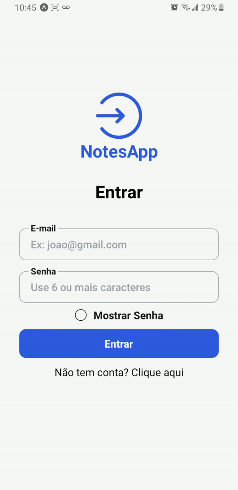

# NotesApp - README

<aside>
💡 App for Notes w/ [backend](https://github.com/matheudsp/notesapp-backend)

</aside>

---



---

## Technologies

- [React](https://reactjs.org/)
- Expo
- [PostgreSQL](https://www.pgadmin.org/)

---

## 🧾 Dependencies

```json
"dependencies": {
    "@react-native-async-storage/async-storage": "1.17.11",
    "@react-navigation/drawer": "^6.6.2",
    "@react-navigation/native": "^6.1.6",
    "@react-navigation/native-stack": "^6.9.12",
    "axios": "^1.3.4",
    "expo": "^48.0.10",
    "expo-blur": "^12.2.2",
    "expo-haptics": "^12.2.1",
    "expo-status-bar": "^1.4.4",
    "react": "18.2.0",
    "react-native": "0.71.6",
    "react-native-bouncy-checkbox": "^3.0.7",
    "react-native-gesture-handler": "^2.9.0",
    "react-native-hold-menu": "^0.1.5",
    "react-native-reanimated": "~2.14.4",
    "react-native-safe-area-context": "^4.5.0",
    "react-native-screens": "^3.20.0"
  },
  "devDependencies": {
    "@babel/core": "^7.20.0",
    "@types/react": "^18.0.28",
    "@types/react-native": "^0.71.3",
    "@types/styled-components": "^5.1.26",
    "typescript": "^4.9.5"
  },
```

---

## ⚙️ Requirements

- [Git](https://git-scm.com/)
- [Node.js](https://nodejs.org/en/)
- [NPM](https://www.npmjs.com/) or [Yarn](https://yarnpkg.com/)

---

## 🚀 Installation

```powershell
$ git clone https://github.com/matheudsp/notesapp.git

$ npm install
$ npm start

in PgAdmin
$ CREATE DATABASE example

in CMD
$ npm install prisma --save-dev
$ npx prisma migrate dev
```

[Backend](https://github.com/matheudsp/notesapp-backend) needed

You will need to create a database through PostgreSQL and set the DATABASE_URL in the .env file to point to your existing database.

You will also need to install Prism to perform database schema migration